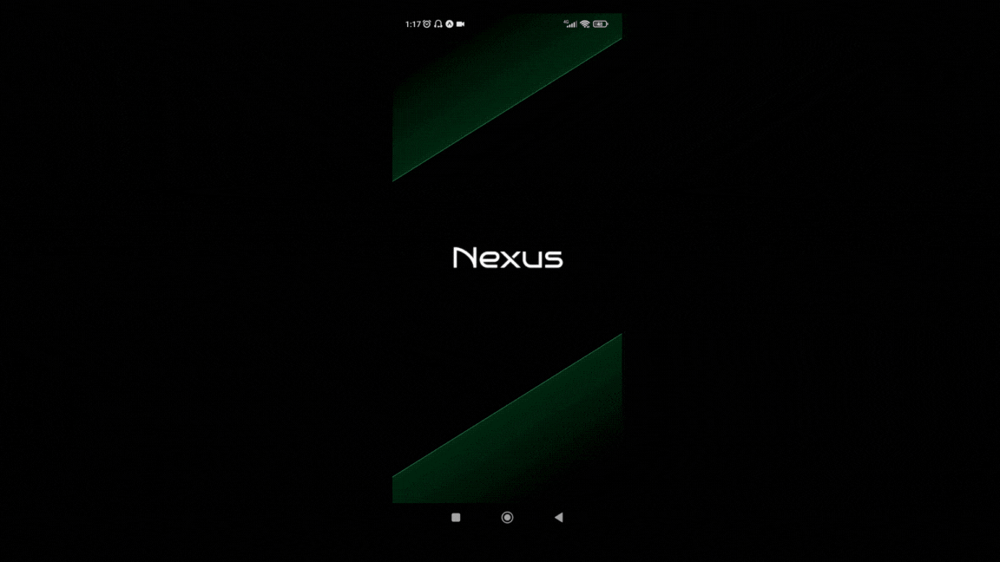

    <h2>⚜️ N E X U S ⚜️</h2>

    <a href="#-projeto">Projeto</a>&nbsp;&nbsp;&nbsp;|&nbsp;&nbsp;&nbsp;
    <a href="#-tecnologias">Tecnologias</a>&nbsp;&nbsp;&nbsp;|&nbsp;&nbsp;&nbsp;
    <a href="#-funcionalidades">Funcionalidades</a>

 

    

 

## 📚 Projeto

O objetivo deste projeto é desenvolver contador regressivo para o lançamento oficial da solução do desafio proposto pelo Challenge FIAP - 2024

O aplicativo conta com o sistema de registro, validação e gerenciamento de usuário sendo feito com o auxílio dos serviços do clerk, além de gerar um username aleatório através da API Ninja.

 

## 🖥 Tecnologias

- [React-Native](https://reactnative.dev)
- [Expo](https://expo.dev)
- [TypeScript](https://www.typescriptlang.org/)
- [Tailwindcss](https://tailwindcss.com/)
- [Clerk](https://clerk.com)
- [API-Ninja](https://api-ninjas.com)

 

## 🧾 Funcionalidades

- [x] Coletar, validar e gerenciar dados de usuários.
- [x] Geração de um username aleatório via API.
- [x] Contador regressivo.
